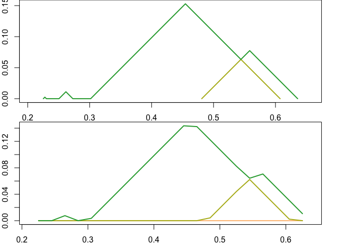

<!-- README.md is generated from README.rmd. Please edit that file -->

    ## ℹ Loading plt

    ## Exports from /Users/jason.brunson/Documents/software/plt/src/interface.cpp:
    ## 
    ## /Users/jason.brunson/Documents/software/plt/src/RcppExports.cpp updated.

    ## Re-compiling plt

    ##   ─  installing *source* package ‘plt’ ...
    ##      ** using staged installation
    ##      ** libs
    ##      clang++ -mmacosx-version-min=10.13 -std=gnu++14 -I"/Library/Frameworks/R.framework/Resources/include" -DNDEBUG  -I'/Library/Frameworks/R.framework/Versions/4.2/Resources/library/Rcpp/include' -I/usr/local/include   -fPIC  -Wall -g -O2  -UNDEBUG -Wall -pedantic -g -O0 -c RcppExports.cpp -o RcppExports.o
    ##      clang++ -mmacosx-version-min=10.13 -std=gnu++14 -I"/Library/Frameworks/R.framework/Resources/include" -DNDEBUG  -I'/Library/Frameworks/R.framework/Versions/4.2/Resources/library/Rcpp/include' -I/usr/local/include   -fPIC  -Wall -g -O2  -UNDEBUG -Wall -pedantic -g -O0 -c interface.cpp -o interface.o
    ##      clang++ -mmacosx-version-min=10.13 -std=gnu++14 -dynamiclib -Wl,-headerpad_max_install_names -undefined dynamic_lookup -single_module -multiply_defined suppress -L/Library/Frameworks/R.framework/Resources/lib -L/usr/local/lib -o plt.so RcppExports.o interface.o -F/Library/Frameworks/R.framework/.. -framework R -Wl,-framework -Wl,CoreFoundation
    ##      installing to /private/var/folders/k6/l4mq9ctj3219429xnvqpdbxm8tckkx/T/Rtmp6gOdE0/devtools_install_5c9710f7e60/00LOCK-plt/00new/plt/libs
    ##      ** checking absolute paths in shared objects and dynamic libraries
    ##   ─  DONE (plt)
    ## 

# plt

Persistence landscapes are a vectorization of persistence data (also
called persistence diagrams), [originated by Peter
Bubenik](https://jmlr.csail.mit.edu/papers/v16/bubenik15a.html), that
have useful statistical properties including linearity and an inner
product. This is an R package interface to [Paweł Dłotko’s Persistence
Landscapes
Toolbox](https://www2.math.upenn.edu/~dlotko/persistenceLandscape.html),
[developed with
Bubenik](https://www.sciencedirect.com/science/article/pii/S0747717116300104)
to efficienctly compute and calculate with persistence landscapes. It
was adapted from [Jose Bouza’s **tda-tools**
package](https://github.com/jjbouza/tda-tools), a TDA pipeline used by
[Bubenik’s
lab](https://people.clas.ufl.edu/peterbubenik/researchgroup/).

## Installation

Since the package is not on CRAN, we suggest that you install
**remotes** on your system. To do this just open an R session and run:

``` r
install.packages("remotes")
```

Then install the package from the GitHub repository as follows:

``` r
remotes::install_github("corybrunson/plt")
```

Alternatively, you can clone or download the code repository and install
the package from source (from within the directory):

``` r
devtools::install()
```

You should now be able to load the package normally from an R session:

``` r
library(plt)
```

## Quickstart Guide

The **plt** package supports various operations involving persistence
landscapes:

-   Compute persistence landscapes from persistence data
-   Perform Hilbert space operations (vector space operations and an
    inner product) on persistence landscapes
-   Plot persistence landscapes

Examples and tests in **plt** rely on other packages to simulate data
and to compute persistence diagrams from data:

-   **tdaunif** provides functions to sample uniformly from various
    immersed manifolds.
-   **ripserr** and **TDA** provide functions to compute persistence
    data from point clouds and distance matrices.

### Calculation

**plt** introduces the ‘Rcpp_PersistenceLandscape’ S4 class, which is
exposed using **Rcpp** from the underlying ‘PersistenceLandscape’ C++
class. Instances of this class can be created using `new()` but the
recommended way is to use `landscape()`. This function accepts either a
single matrix of persistence data or a persistence diagram object, which
is a specially formatted list containing the first and most important
element `$pairs`. The `$pairs` entry is itself a list, of a 2-column
matrix of persistence pairs for each homological degree from 0
(`$pairs[[1]]`) to the maximum degree calculated. The generic conversion
function `as_persistence()` includes methods for outputs from
`ripserr::vietoris_rips()` and from `TDA::*Diag()`.

To begin an illustration, we noisily sample 60 points from a figure
eight and compute the persistence diagram of the point cloud:

``` r
set.seed(513611L)
pc <- tdaunif::sample_lemniscate_gerono(60, sd = .1)
pd <- ripserr::vietoris_rips(pc, max_dim = 1, threshold = 2, p = 2)
print(pd)
#> PHom object containing persistence data for 63 features.
#> 
#> Contains:
#> * 59 0-dim features
#> * 4 1-dim features
#> 
#> Radius/diameter: min = 0; max = 0.63582.
```

We the convert the persistence data to the preferred persistence diagram
format and inspect some of its features:

``` r
pd <- as_persistence(pd)
print(head(pd$pairs[[1]]))
#>      [,1]       [,2]
#> [1,]    0 0.01918952
#> [2,]    0 0.01947548
#> [3,]    0 0.02604350
#> [4,]    0 0.04218479
#> [5,]    0 0.04542467
#> [6,]    0 0.05941691
print(head(pd$pairs[[2]]))
#>           [,1]      [,2]
#> [1,] 0.4809292 0.6358225
#> [2,] 0.3016234 0.6075172
#> [3,] 0.2504500 0.2727915
#> [4,] 0.2251884 0.2300871
```

This allows us to compute a persistence landscape—in this case, for the
1-dimensional features. Here we compute the landscape exactly, which can
be cost-prohibitive for larger persistence data:

``` r
pl1 <- landscape(pd, degree = 1, exact = TRUE)
print(pl1)
#> Persistence landscape (exact format) of 2 envelopes over (0.2,0.6)
```

### Class

The object `pl1` is not an array, but rather an object that encapsulates
both the data that encode a landscape and several basic operations that
can be performed on it. This allows us to work with persistence
landscapes without worrying about pre-processing their representations.
At any point, the underlying landscape can be extracted using
`$getInternal()`, which in the case of an exactly calculated landscape
returns a list of 2-column matrices, each matrix containing coordinates
that define one level of the landscape as a piecewise linear function:

``` r
print(length(pl1$getInternal()))
#> [1] 2
print(pl1$getInternal())
#> [[1]]
#>            [,1]        [,2]
#>  [1,]      -Inf 0.000000000
#>  [2,] 0.2251884 0.000000000
#>  [3,] 0.2276378 0.002449358
#>  [4,] 0.2300871 0.000000000
#>  [5,] 0.2504500 0.000000000
#>  [6,] 0.2616207 0.011170764
#>  [7,] 0.2727915 0.000000000
#>  [8,] 0.3016234 0.000000000
#>  [9,] 0.4545703 0.152946885
#> [10,] 0.5442232 0.063293964
#> [11,] 0.5583759 0.077446647
#> [12,] 0.6358225 0.000000000
#> [13,]       Inf 0.000000000
#> 
#> [[2]]
#>           [,1]       [,2]
#> [1,]      -Inf 0.00000000
#> [2,] 0.4809292 0.00000000
#> [3,] 0.5442232 0.06329396
#> [4,] 0.6075172 0.00000000
#> [5,]       Inf 0.00000000
```

The length of this list is the number of levels of the landscape.

An alternative, approximate construction computes the value of each
level of the landscape at each point on a 1-dimensional grid, ranging
from `min_b` to `max_b` at increments of `by`. A landscape constructed
using a discrete approximation is stored as a 3-dimensional array of
dimensions (levels, values, 2), with one level per feature (some of
which may be trivial) and one value per grid point, stored as $x,y$
pairs along the third dimension.

``` r
b_ran <- pl_support(pl1)
pl1d <- landscape(pd, degree = 1,
                  min_b = b_ran[[1L]], max_b = b_ran[[2L]], by = 0.02)
print(dim(pl1d$getInternal()))
#> [1]  4 21  2
print(pl1d$getInternal())
#> , , 1
#> 
#>           [,1]      [,2]      [,3]      [,4]      [,5]      [,6]      [,7]
#> [1,] 0.2251884 0.2451884 0.2651884 0.2851884 0.3051884 0.3251884 0.3451884
#> [2,] 0.2251884 0.2451884 0.2651884 0.2851884 0.3051884 0.3251884 0.3451884
#> [3,] 0.2251884 0.2451884 0.2651884 0.2851884 0.3051884 0.3251884 0.3451884
#> [4,] 0.2251884 0.2451884 0.2651884 0.2851884 0.3051884 0.3251884 0.3451884
#>           [,8]      [,9]     [,10]     [,11]     [,12]     [,13]     [,14]
#> [1,] 0.3651884 0.3851884 0.4051884 0.4251884 0.4451884 0.4651884 0.4851884
#> [2,] 0.3651884 0.3851884 0.4051884 0.4251884 0.4451884 0.4651884 0.4851884
#> [3,] 0.3651884 0.3851884 0.4051884 0.4251884 0.4451884 0.4651884 0.4851884
#> [4,] 0.3651884 0.3851884 0.4051884 0.4251884 0.4451884 0.4651884 0.4851884
#>          [,15]     [,16]     [,17]     [,18]     [,19]     [,20]     [,21]
#> [1,] 0.5051884 0.5251884 0.5451884 0.5651884 0.5851884 0.6051884 0.6251884
#> [2,] 0.5051884 0.5251884 0.5451884 0.5651884 0.5851884 0.6051884 0.6251884
#> [3,] 0.5051884 0.5251884 0.5451884 0.5651884 0.5851884 0.6051884 0.6251884
#> [4,] 0.5051884 0.5251884 0.5451884 0.5651884 0.5851884 0.6051884 0.6251884
#> 
#> , , 2
#> 
#>      [,1] [,2]        [,3] [,4]        [,5]       [,6]       [,7]       [,8]
#> [1,]    0    0 0.007603077    0 0.003565016 0.02356502 0.04356502 0.06356502
#> [2,]    0    0 0.000000000    0 0.000000000 0.00000000 0.00000000 0.00000000
#> [3,]    0    0 0.000000000    0 0.000000000 0.00000000 0.00000000 0.00000000
#> [4,]    0    0 0.000000000    0 0.000000000 0.00000000 0.00000000 0.00000000
#>            [,9]    [,10]    [,11]    [,12]     [,13]       [,14]      [,15]
#> [1,] 0.08356502 0.103565 0.123565 0.143565 0.1423288 0.122328755 0.10232875
#> [2,] 0.00000000 0.000000 0.000000 0.000000 0.0000000 0.004259174 0.02425917
#> [3,] 0.00000000 0.000000 0.000000 0.000000 0.0000000 0.000000000 0.00000000
#> [4,] 0.00000000 0.000000 0.000000 0.000000 0.0000000 0.000000000 0.00000000
#>           [,16]      [,17]      [,18]      [,19]       [,20]      [,21]
#> [1,] 0.08232875 0.06425917 0.07063412 0.05063412 0.030634119 0.01063412
#> [2,] 0.04425917 0.06232875 0.04232875 0.02232875 0.002328755 0.00000000
#> [3,] 0.00000000 0.00000000 0.00000000 0.00000000 0.000000000 0.00000000
#> [4,] 0.00000000 0.00000000 0.00000000 0.00000000 0.000000000 0.00000000
```

Exactly computed landscapes can be converted to discrete landscape
objects, but the other direction is not well-defined:

``` r
# TODO: Export method with `min_b,max_b,by` parameters.
pl1$getDiscrete()
#> , , 1
#> 
#>       [,1]  [,2]  [,3]  [,4]  [,5]  [,6]  [,7]  [,8]  [,9] [,10] [,11] [,12]
#> [1,] 0.001 0.002 0.003 0.004 0.005 0.006 0.007 0.008 0.009  0.01 0.011 0.012
#> [2,] 0.001 0.002 0.003 0.004 0.005 0.006 0.007 0.008 0.009  0.01 0.011 0.012
#>      [,13] [,14] [,15] [,16] [,17] [,18] [,19] [,20] [,21] [,22] [,23] [,24]
#> [1,] 0.013 0.014 0.015 0.016 0.017 0.018 0.019  0.02 0.021 0.022 0.023 0.024
#> [2,] 0.013 0.014 0.015 0.016 0.017 0.018 0.019  0.02 0.021 0.022 0.023 0.024
#>      [,25] [,26] [,27] [,28] [,29] [,30] [,31] [,32] [,33] [,34] [,35] [,36]
#> [1,] 0.025 0.026 0.027 0.028 0.029  0.03 0.031 0.032 0.033 0.034 0.035 0.036
#> [2,] 0.025 0.026 0.027 0.028 0.029  0.03 0.031 0.032 0.033 0.034 0.035 0.036
#>      [,37] [,38] [,39] [,40] [,41] [,42] [,43] [,44] [,45] [,46] [,47] [,48]
#> [1,] 0.037 0.038 0.039  0.04 0.041 0.042 0.043 0.044 0.045 0.046 0.047 0.048
#> [2,] 0.037 0.038 0.039  0.04 0.041 0.042 0.043 0.044 0.045 0.046 0.047 0.048
#>      [,49] [,50] [,51] [,52] [,53] [,54] [,55] [,56] [,57] [,58] [,59] [,60]
#> [1,] 0.049  0.05 0.051 0.052 0.053 0.054 0.055 0.056 0.057 0.058 0.059  0.06
#> [2,] 0.049  0.05 0.051 0.052 0.053 0.054 0.055 0.056 0.057 0.058 0.059  0.06
#>      [,61] [,62] [,63] [,64] [,65] [,66] [,67] [,68] [,69] [,70] [,71] [,72]
#> [1,] 0.061 0.062 0.063 0.064 0.065 0.066 0.067 0.068 0.069  0.07 0.071 0.072
#> [2,] 0.061 0.062 0.063 0.064 0.065 0.066 0.067 0.068 0.069  0.07 0.071 0.072
#>      [,73] [,74] [,75] [,76] [,77] [,78] [,79] [,80] [,81] [,82] [,83] [,84]
#> [1,] 0.073 0.074 0.075 0.076 0.077 0.078 0.079  0.08 0.081 0.082 0.083 0.084
#> [2,] 0.073 0.074 0.075 0.076 0.077 0.078 0.079  0.08 0.081 0.082 0.083 0.084
#>      [,85] [,86] [,87] [,88] [,89] [,90] [,91] [,92] [,93] [,94] [,95] [,96]
#> [1,] 0.085 0.086 0.087 0.088 0.089  0.09 0.091 0.092 0.093 0.094 0.095 0.096
#> [2,] 0.085 0.086 0.087 0.088 0.089  0.09 0.091 0.092 0.093 0.094 0.095 0.096
#>      [,97] [,98] [,99] [,100] [,101] [,102] [,103] [,104] [,105] [,106] [,107]
#> [1,] 0.097 0.098 0.099    0.1  0.101  0.102  0.103  0.104  0.105  0.106  0.107
#> [2,] 0.097 0.098 0.099    0.1  0.101  0.102  0.103  0.104  0.105  0.106  0.107
#>      [,108] [,109] [,110] [,111] [,112] [,113] [,114] [,115] [,116] [,117]
#> [1,]  0.108  0.109   0.11  0.111  0.112  0.113  0.114  0.115  0.116  0.117
#> [2,]  0.108  0.109   0.11  0.111  0.112  0.113  0.114  0.115  0.116  0.117
#>      [,118] [,119] [,120] [,121] [,122] [,123] [,124] [,125] [,126] [,127]
#> [1,]  0.118  0.119   0.12  0.121  0.122  0.123  0.124  0.125  0.126  0.127
#> [2,]  0.118  0.119   0.12  0.121  0.122  0.123  0.124  0.125  0.126  0.127
#>      [,128] [,129] [,130] [,131] [,132] [,133] [,134] [,135] [,136] [,137]
#> [1,]  0.128  0.129   0.13  0.131  0.132  0.133  0.134  0.135  0.136  0.137
#> [2,]  0.128  0.129   0.13  0.131  0.132  0.133  0.134  0.135  0.136  0.137
#>      [,138] [,139] [,140] [,141] [,142] [,143] [,144] [,145] [,146] [,147]
#> [1,]  0.138  0.139   0.14  0.141  0.142  0.143  0.144  0.145  0.146  0.147
#> [2,]  0.138  0.139   0.14  0.141  0.142  0.143  0.144  0.145  0.146  0.147
#>      [,148] [,149] [,150] [,151] [,152] [,153] [,154] [,155] [,156] [,157]
#> [1,]  0.148  0.149   0.15  0.151  0.152  0.153  0.154  0.155  0.156  0.157
#> [2,]  0.148  0.149   0.15  0.151  0.152  0.153  0.154  0.155  0.156  0.157
#>      [,158] [,159] [,160] [,161] [,162] [,163] [,164] [,165] [,166] [,167]
#> [1,]  0.158  0.159   0.16  0.161  0.162  0.163  0.164  0.165  0.166  0.167
#> [2,]  0.158  0.159   0.16  0.161  0.162  0.163  0.164  0.165  0.166  0.167
#>      [,168] [,169] [,170] [,171] [,172] [,173] [,174] [,175] [,176] [,177]
#> [1,]  0.168  0.169   0.17  0.171  0.172  0.173  0.174  0.175  0.176  0.177
#> [2,]  0.168  0.169   0.17  0.171  0.172  0.173  0.174  0.175  0.176  0.177
#>      [,178] [,179] [,180] [,181] [,182] [,183] [,184] [,185] [,186] [,187]
#> [1,]  0.178  0.179   0.18  0.181  0.182  0.183  0.184  0.185  0.186  0.187
#> [2,]  0.178  0.179   0.18  0.181  0.182  0.183  0.184  0.185  0.186  0.187
#>      [,188] [,189] [,190] [,191] [,192] [,193] [,194] [,195] [,196] [,197]
#> [1,]  0.188  0.189   0.19  0.191  0.192  0.193  0.194  0.195  0.196  0.197
#> [2,]  0.188  0.189   0.19  0.191  0.192  0.193  0.194  0.195  0.196  0.197
#>      [,198] [,199] [,200] [,201] [,202] [,203] [,204] [,205] [,206] [,207]
#> [1,]  0.198  0.199    0.2  0.201  0.202  0.203  0.204  0.205  0.206  0.207
#> [2,]  0.198  0.199    0.2  0.201  0.202  0.203  0.204  0.205  0.206  0.207
#>      [,208] [,209] [,210] [,211] [,212] [,213] [,214] [,215] [,216] [,217]
#> [1,]  0.208  0.209   0.21  0.211  0.212  0.213  0.214  0.215  0.216  0.217
#> [2,]  0.208  0.209   0.21  0.211  0.212  0.213  0.214  0.215  0.216  0.217
#>      [,218] [,219] [,220] [,221] [,222] [,223] [,224] [,225] [,226] [,227]
#> [1,]  0.218  0.219   0.22  0.221  0.222  0.223  0.224  0.225  0.226  0.227
#> [2,]  0.218  0.219   0.22  0.221  0.222  0.223  0.224  0.225  0.226  0.227
#>      [,228] [,229] [,230] [,231] [,232] [,233] [,234] [,235] [,236] [,237]
#> [1,]  0.228  0.229   0.23  0.231  0.232  0.233  0.234  0.235  0.236  0.237
#> [2,]  0.228  0.229   0.23  0.231  0.232  0.233  0.234  0.235  0.236  0.237
#>      [,238] [,239] [,240] [,241] [,242] [,243] [,244] [,245] [,246] [,247]
#> [1,]  0.238  0.239   0.24  0.241  0.242  0.243  0.244  0.245  0.246  0.247
#> [2,]  0.238  0.239   0.24  0.241  0.242  0.243  0.244  0.245  0.246  0.247
#>      [,248] [,249] [,250] [,251] [,252] [,253] [,254] [,255] [,256] [,257]
#> [1,]  0.248  0.249   0.25  0.251  0.252  0.253  0.254  0.255  0.256  0.257
#> [2,]  0.248  0.249   0.25  0.251  0.252  0.253  0.254  0.255  0.256  0.257
#>      [,258] [,259] [,260] [,261] [,262] [,263] [,264] [,265] [,266] [,267]
#> [1,]  0.258  0.259   0.26  0.261  0.262  0.263  0.264  0.265  0.266  0.267
#> [2,]  0.258  0.259   0.26  0.261  0.262  0.263  0.264  0.265  0.266  0.267
#>      [,268] [,269] [,270] [,271] [,272] [,273] [,274] [,275] [,276] [,277]
#> [1,]  0.268  0.269   0.27  0.271  0.272  0.273  0.274  0.275  0.276  0.277
#> [2,]  0.268  0.269   0.27  0.271  0.272  0.273  0.274  0.275  0.276  0.277
#>      [,278] [,279] [,280] [,281] [,282] [,283] [,284] [,285] [,286] [,287]
#> [1,]  0.278  0.279   0.28  0.281  0.282  0.283  0.284  0.285  0.286  0.287
#> [2,]  0.278  0.279   0.28  0.281  0.282  0.283  0.284  0.285  0.286  0.287
#>      [,288] [,289] [,290] [,291] [,292] [,293] [,294] [,295] [,296] [,297]
#> [1,]  0.288  0.289   0.29  0.291  0.292  0.293  0.294  0.295  0.296  0.297
#> [2,]  0.288  0.289   0.29  0.291  0.292  0.293  0.294  0.295  0.296  0.297
#>      [,298] [,299] [,300] [,301] [,302] [,303] [,304] [,305] [,306] [,307]
#> [1,]  0.298  0.299    0.3  0.301  0.302  0.303  0.304  0.305  0.306  0.307
#> [2,]  0.298  0.299    0.3  0.301  0.302  0.303  0.304  0.305  0.306  0.307
#>      [,308] [,309] [,310] [,311] [,312] [,313] [,314] [,315] [,316] [,317]
#> [1,]  0.308  0.309   0.31  0.311  0.312  0.313  0.314  0.315  0.316  0.317
#> [2,]  0.308  0.309   0.31  0.311  0.312  0.313  0.314  0.315  0.316  0.317
#>      [,318] [,319] [,320] [,321] [,322] [,323] [,324] [,325] [,326] [,327]
#> [1,]  0.318  0.319   0.32  0.321  0.322  0.323  0.324  0.325  0.326  0.327
#> [2,]  0.318  0.319   0.32  0.321  0.322  0.323  0.324  0.325  0.326  0.327
#>      [,328] [,329] [,330] [,331] [,332] [,333] [,334] [,335] [,336] [,337]
#> [1,]  0.328  0.329   0.33  0.331  0.332  0.333  0.334  0.335  0.336  0.337
#> [2,]  0.328  0.329   0.33  0.331  0.332  0.333  0.334  0.335  0.336  0.337
#>      [,338] [,339] [,340] [,341] [,342] [,343] [,344] [,345] [,346] [,347]
#> [1,]  0.338  0.339   0.34  0.341  0.342  0.343  0.344  0.345  0.346  0.347
#> [2,]  0.338  0.339   0.34  0.341  0.342  0.343  0.344  0.345  0.346  0.347
#>      [,348] [,349] [,350] [,351] [,352] [,353] [,354] [,355] [,356] [,357]
#> [1,]  0.348  0.349   0.35  0.351  0.352  0.353  0.354  0.355  0.356  0.357
#> [2,]  0.348  0.349   0.35  0.351  0.352  0.353  0.354  0.355  0.356  0.357
#>      [,358] [,359] [,360] [,361] [,362] [,363] [,364] [,365] [,366] [,367]
#> [1,]  0.358  0.359   0.36  0.361  0.362  0.363  0.364  0.365  0.366  0.367
#> [2,]  0.358  0.359   0.36  0.361  0.362  0.363  0.364  0.365  0.366  0.367
#>      [,368] [,369] [,370] [,371] [,372] [,373] [,374] [,375] [,376] [,377]
#> [1,]  0.368  0.369   0.37  0.371  0.372  0.373  0.374  0.375  0.376  0.377
#> [2,]  0.368  0.369   0.37  0.371  0.372  0.373  0.374  0.375  0.376  0.377
#>      [,378] [,379] [,380] [,381] [,382] [,383] [,384] [,385] [,386] [,387]
#> [1,]  0.378  0.379   0.38  0.381  0.382  0.383  0.384  0.385  0.386  0.387
#> [2,]  0.378  0.379   0.38  0.381  0.382  0.383  0.384  0.385  0.386  0.387
#>      [,388] [,389] [,390] [,391] [,392] [,393] [,394] [,395] [,396] [,397]
#> [1,]  0.388  0.389   0.39  0.391  0.392  0.393  0.394  0.395  0.396  0.397
#> [2,]  0.388  0.389   0.39  0.391  0.392  0.393  0.394  0.395  0.396  0.397
#>      [,398] [,399] [,400] [,401] [,402] [,403] [,404] [,405] [,406] [,407]
#> [1,]  0.398  0.399    0.4  0.401  0.402  0.403  0.404  0.405  0.406  0.407
#> [2,]  0.398  0.399    0.4  0.401  0.402  0.403  0.404  0.405  0.406  0.407
#>      [,408] [,409] [,410] [,411] [,412] [,413] [,414] [,415] [,416] [,417]
#> [1,]  0.408  0.409   0.41  0.411  0.412  0.413  0.414  0.415  0.416  0.417
#> [2,]  0.408  0.409   0.41  0.411  0.412  0.413  0.414  0.415  0.416  0.417
#>      [,418] [,419] [,420] [,421] [,422] [,423] [,424] [,425] [,426] [,427]
#> [1,]  0.418  0.419   0.42  0.421  0.422  0.423  0.424  0.425  0.426  0.427
#> [2,]  0.418  0.419   0.42  0.421  0.422  0.423  0.424  0.425  0.426  0.427
#>      [,428] [,429] [,430] [,431] [,432] [,433] [,434] [,435] [,436] [,437]
#> [1,]  0.428  0.429   0.43  0.431  0.432  0.433  0.434  0.435  0.436  0.437
#> [2,]  0.428  0.429   0.43  0.431  0.432  0.433  0.434  0.435  0.436  0.437
#>      [,438] [,439] [,440] [,441] [,442] [,443] [,444] [,445] [,446] [,447]
#> [1,]  0.438  0.439   0.44  0.441  0.442  0.443  0.444  0.445  0.446  0.447
#> [2,]  0.438  0.439   0.44  0.441  0.442  0.443  0.444  0.445  0.446  0.447
#>      [,448] [,449] [,450] [,451] [,452] [,453] [,454] [,455] [,456] [,457]
#> [1,]  0.448  0.449   0.45  0.451  0.452  0.453  0.454  0.455  0.456  0.457
#> [2,]  0.448  0.449   0.45  0.451  0.452  0.453  0.454  0.455  0.456  0.457
#>      [,458] [,459] [,460] [,461] [,462] [,463] [,464] [,465] [,466] [,467]
#> [1,]  0.458  0.459   0.46  0.461  0.462  0.463  0.464  0.465  0.466  0.467
#> [2,]  0.458  0.459   0.46  0.461  0.462  0.463  0.464  0.465  0.466  0.467
#>      [,468] [,469] [,470] [,471] [,472] [,473] [,474] [,475] [,476] [,477]
#> [1,]  0.468  0.469   0.47  0.471  0.472  0.473  0.474  0.475  0.476  0.477
#> [2,]  0.468  0.469   0.47  0.471  0.472  0.473  0.474  0.475  0.476  0.477
#>      [,478] [,479] [,480] [,481] [,482] [,483] [,484] [,485] [,486] [,487]
#> [1,]  0.478  0.479   0.48  0.481  0.482  0.483  0.484  0.485  0.486  0.487
#> [2,]  0.478  0.479   0.48  0.481  0.482  0.483  0.484  0.485  0.486  0.487
#>      [,488] [,489] [,490] [,491] [,492] [,493] [,494] [,495] [,496] [,497]
#> [1,]  0.488  0.489   0.49  0.491  0.492  0.493  0.494  0.495  0.496  0.497
#> [2,]  0.488  0.489   0.49  0.491  0.492  0.493  0.494  0.495  0.496  0.497
#>      [,498] [,499] [,500] [,501] [,502] [,503] [,504] [,505] [,506] [,507]
#> [1,]  0.498  0.499    0.5  0.501  0.502  0.503  0.504  0.505  0.506  0.507
#> [2,]  0.498  0.499    0.5  0.501  0.502  0.503  0.504  0.505  0.506  0.507
#>      [,508] [,509] [,510] [,511] [,512] [,513] [,514] [,515] [,516] [,517]
#> [1,]  0.508  0.509   0.51  0.511  0.512  0.513  0.514  0.515  0.516  0.517
#> [2,]  0.508  0.509   0.51  0.511  0.512  0.513  0.514  0.515  0.516  0.517
#>      [,518] [,519] [,520] [,521] [,522] [,523] [,524] [,525] [,526] [,527]
#> [1,]  0.518  0.519   0.52  0.521  0.522  0.523  0.524  0.525  0.526  0.527
#> [2,]  0.518  0.519   0.52  0.521  0.522  0.523  0.524  0.525  0.526  0.527
#>      [,528] [,529] [,530] [,531] [,532] [,533] [,534] [,535] [,536] [,537]
#> [1,]  0.528  0.529   0.53  0.531  0.532  0.533  0.534  0.535  0.536  0.537
#> [2,]  0.528  0.529   0.53  0.531  0.532  0.533  0.534  0.535  0.536  0.537
#>      [,538] [,539] [,540] [,541] [,542] [,543] [,544] [,545] [,546] [,547]
#> [1,]  0.538  0.539   0.54  0.541  0.542  0.543  0.544  0.545  0.546  0.547
#> [2,]  0.538  0.539   0.54  0.541  0.542  0.543  0.544  0.545  0.546  0.547
#>      [,548] [,549] [,550] [,551] [,552] [,553] [,554] [,555] [,556] [,557]
#> [1,]  0.548  0.549   0.55  0.551  0.552  0.553  0.554  0.555  0.556  0.557
#> [2,]  0.548  0.549   0.55  0.551  0.552  0.553  0.554  0.555  0.556  0.557
#>      [,558] [,559] [,560] [,561] [,562] [,563] [,564] [,565] [,566] [,567]
#> [1,]  0.558  0.559   0.56  0.561  0.562  0.563  0.564  0.565  0.566  0.567
#> [2,]  0.558  0.559   0.56  0.561  0.562  0.563  0.564  0.565  0.566  0.567
#>      [,568] [,569] [,570] [,571] [,572] [,573] [,574] [,575] [,576] [,577]
#> [1,]  0.568  0.569   0.57  0.571  0.572  0.573  0.574  0.575  0.576  0.577
#> [2,]  0.568  0.569   0.57  0.571  0.572  0.573  0.574  0.575  0.576  0.577
#>      [,578] [,579] [,580] [,581] [,582] [,583] [,584] [,585] [,586] [,587]
#> [1,]  0.578  0.579   0.58  0.581  0.582  0.583  0.584  0.585  0.586  0.587
#> [2,]  0.578  0.579   0.58  0.581  0.582  0.583  0.584  0.585  0.586  0.587
#>      [,588] [,589] [,590] [,591] [,592] [,593] [,594] [,595] [,596] [,597]
#> [1,]  0.588  0.589   0.59  0.591  0.592  0.593  0.594  0.595  0.596  0.597
#> [2,]  0.588  0.589   0.59  0.591  0.592  0.593  0.594  0.595  0.596  0.597
#>      [,598] [,599] [,600] [,601] [,602] [,603] [,604] [,605] [,606] [,607]
#> [1,]  0.598  0.599    0.6  0.601  0.602  0.603  0.604  0.605  0.606  0.607
#> [2,]  0.598  0.599    0.6  0.601  0.602  0.603  0.604  0.605  0.606  0.607
#>      [,608] [,609] [,610] [,611] [,612] [,613] [,614] [,615] [,616] [,617]
#> [1,]  0.608  0.609   0.61  0.611  0.612  0.613  0.614  0.615  0.616  0.617
#> [2,]  0.608  0.609   0.61  0.611  0.612  0.613  0.614  0.615  0.616  0.617
#>      [,618] [,619] [,620] [,621] [,622] [,623] [,624] [,625] [,626] [,627]
#> [1,]  0.618  0.619   0.62  0.621  0.622  0.623  0.624  0.625  0.626  0.627
#> [2,]  0.618  0.619   0.62  0.621  0.622  0.623  0.624  0.625  0.626  0.627
#>      [,628] [,629] [,630] [,631] [,632] [,633] [,634] [,635] [,636]
#> [1,]  0.628  0.629   0.63  0.631  0.632  0.633  0.634  0.635  0.636
#> [2,]  0.628  0.629   0.63  0.631  0.632  0.633  0.634  0.635  0.636
#> 
#> , , 2
#> 
#>      [,1] [,2] [,3] [,4] [,5] [,6] [,7] [,8] [,9] [,10] [,11] [,12] [,13] [,14]
#> [1,]    0    0    0    0    0    0    0    0    0     0     0     0     0     0
#> [2,]    0    0    0    0    0    0    0    0    0     0     0     0     0     0
#>      [,15] [,16] [,17] [,18] [,19] [,20] [,21] [,22] [,23] [,24] [,25] [,26]
#> [1,]     0     0     0     0     0     0     0     0     0     0     0     0
#> [2,]     0     0     0     0     0     0     0     0     0     0     0     0
#>      [,27] [,28] [,29] [,30] [,31] [,32] [,33] [,34] [,35] [,36] [,37] [,38]
#> [1,]     0     0     0     0     0     0     0     0     0     0     0     0
#> [2,]     0     0     0     0     0     0     0     0     0     0     0     0
#>      [,39] [,40] [,41] [,42] [,43] [,44] [,45] [,46] [,47] [,48] [,49] [,50]
#> [1,]     0     0     0     0     0     0     0     0     0     0     0     0
#> [2,]     0     0     0     0     0     0     0     0     0     0     0     0
#>      [,51] [,52] [,53] [,54] [,55] [,56] [,57] [,58] [,59] [,60] [,61] [,62]
#> [1,]     0     0     0     0     0     0     0     0     0     0     0     0
#> [2,]     0     0     0     0     0     0     0     0     0     0     0     0
#>      [,63] [,64] [,65] [,66] [,67] [,68] [,69] [,70] [,71] [,72] [,73] [,74]
#> [1,]     0     0     0     0     0     0     0     0     0     0     0     0
#> [2,]     0     0     0     0     0     0     0     0     0     0     0     0
#>      [,75] [,76] [,77] [,78] [,79] [,80] [,81] [,82] [,83] [,84] [,85] [,86]
#> [1,]     0     0     0     0     0     0     0     0     0     0     0     0
#> [2,]     0     0     0     0     0     0     0     0     0     0     0     0
#>      [,87] [,88] [,89] [,90] [,91] [,92] [,93] [,94] [,95] [,96] [,97] [,98]
#> [1,]     0     0     0     0     0     0     0     0     0     0     0     0
#> [2,]     0     0     0     0     0     0     0     0     0     0     0     0
#>      [,99] [,100] [,101] [,102] [,103] [,104] [,105] [,106] [,107] [,108]
#> [1,]     0      0      0      0      0      0      0      0      0      0
#> [2,]     0      0      0      0      0      0      0      0      0      0
#>      [,109] [,110] [,111] [,112] [,113] [,114] [,115] [,116] [,117] [,118]
#> [1,]      0      0      0      0      0      0      0      0      0      0
#> [2,]      0      0      0      0      0      0      0      0      0      0
#>      [,119] [,120] [,121] [,122] [,123] [,124] [,125] [,126] [,127] [,128]
#> [1,]      0      0      0      0      0      0      0      0      0      0
#> [2,]      0      0      0      0      0      0      0      0      0      0
#>      [,129] [,130] [,131] [,132] [,133] [,134] [,135] [,136] [,137] [,138]
#> [1,]      0      0      0      0      0      0      0      0      0      0
#> [2,]      0      0      0      0      0      0      0      0      0      0
#>      [,139] [,140] [,141] [,142] [,143] [,144] [,145] [,146] [,147] [,148]
#> [1,]      0      0      0      0      0      0      0      0      0      0
#> [2,]      0      0      0      0      0      0      0      0      0      0
#>      [,149] [,150] [,151] [,152] [,153] [,154] [,155] [,156] [,157] [,158]
#> [1,]      0      0      0      0      0      0      0      0      0      0
#> [2,]      0      0      0      0      0      0      0      0      0      0
#>      [,159] [,160] [,161] [,162] [,163] [,164] [,165] [,166] [,167] [,168]
#> [1,]      0      0      0      0      0      0      0      0      0      0
#> [2,]      0      0      0      0      0      0      0      0      0      0
#>      [,169] [,170] [,171] [,172] [,173] [,174] [,175] [,176] [,177] [,178]
#> [1,]      0      0      0      0      0      0      0      0      0      0
#> [2,]      0      0      0      0      0      0      0      0      0      0
#>      [,179] [,180] [,181] [,182] [,183] [,184] [,185] [,186] [,187] [,188]
#> [1,]      0      0      0      0      0      0      0      0      0      0
#> [2,]      0      0      0      0      0      0      0      0      0      0
#>      [,189] [,190] [,191] [,192] [,193] [,194] [,195] [,196] [,197] [,198]
#> [1,]      0      0      0      0      0      0      0      0      0      0
#> [2,]      0      0      0      0      0      0      0      0      0      0
#>      [,199] [,200] [,201] [,202] [,203] [,204] [,205] [,206] [,207] [,208]
#> [1,]      0      0      0      0      0      0      0      0      0      0
#> [2,]      0      0      0      0      0      0      0      0      0      0
#>      [,209] [,210] [,211] [,212] [,213] [,214] [,215] [,216] [,217] [,218]
#> [1,]      0      0      0      0      0      0      0      0      0      0
#> [2,]      0      0      0      0      0      0      0      0      0      0
#>      [,219] [,220] [,221] [,222] [,223] [,224] [,225] [,226] [,227] [,228]
#> [1,]      0      0      0      0      0      0      0      0  0.001  0.002
#> [2,]      0      0      0      0      0      0      0      0  0.000  0.000
#>      [,229] [,230] [,231] [,232] [,233] [,234] [,235] [,236] [,237] [,238]
#> [1,]  0.001      0 -0.001 -0.001 -0.001 -0.001 -0.001 -0.001 -0.001 -0.001
#> [2,]  0.000      0  0.000  0.000  0.000  0.000  0.000  0.000  0.000  0.000
#>      [,239] [,240] [,241] [,242] [,243] [,244] [,245] [,246] [,247] [,248]
#> [1,] -0.001 -0.001 -0.001 -0.001 -0.001 -0.001 -0.001 -0.001 -0.001 -0.001
#> [2,]  0.000  0.000  0.000  0.000  0.000  0.000  0.000  0.000  0.000  0.000
#>      [,249] [,250] [,251]        [,252] [,253] [,254] [,255] [,256] [,257]
#> [1,] -0.001 -0.001 -0.001 -2.385245e-18  0.001  0.002  0.003  0.004  0.005
#> [2,]  0.000  0.000  0.000  0.000000e+00  0.000  0.000  0.000  0.000  0.000
#>      [,258] [,259] [,260] [,261] [,262] [,263] [,264] [,265] [,266] [,267]
#> [1,]  0.006  0.007  0.008  0.009   0.01  0.009  0.008  0.007  0.006  0.005
#> [2,]  0.000  0.000  0.000  0.000   0.00  0.000  0.000  0.000  0.000  0.000
#>      [,268] [,269] [,270] [,271]        [,272] [,273] [,274] [,275] [,276]
#> [1,]  0.004  0.003  0.002  0.001 -2.168404e-18 -0.001 -0.001 -0.001 -0.001
#> [2,]  0.000  0.000  0.000  0.000  0.000000e+00  0.000  0.000  0.000  0.000
#>      [,277] [,278] [,279] [,280] [,281] [,282] [,283] [,284] [,285] [,286]
#> [1,] -0.001 -0.001 -0.001 -0.001 -0.001 -0.001 -0.001 -0.001 -0.001 -0.001
#> [2,]  0.000  0.000  0.000  0.000  0.000  0.000  0.000  0.000  0.000  0.000
#>      [,287] [,288] [,289] [,290] [,291] [,292] [,293] [,294] [,295] [,296]
#> [1,] -0.001 -0.001 -0.001 -0.001 -0.001 -0.001 -0.001 -0.001 -0.001 -0.001
#> [2,]  0.000  0.000  0.000  0.000  0.000  0.000  0.000  0.000  0.000  0.000
#>      [,297] [,298] [,299] [,300] [,301] [,302] [,303] [,304] [,305] [,306]
#> [1,] -0.001 -0.001 -0.001 -0.001 -0.001 -0.001      0  0.001  0.002  0.003
#> [2,]  0.000  0.000  0.000  0.000  0.000  0.000      0  0.000  0.000  0.000
#>      [,307] [,308] [,309] [,310] [,311] [,312] [,313] [,314] [,315] [,316]
#> [1,]  0.004  0.005  0.006  0.007  0.008  0.009   0.01  0.011  0.012  0.013
#> [2,]  0.000  0.000  0.000  0.000  0.000  0.000   0.00  0.000  0.000  0.000
#>      [,317] [,318] [,319] [,320] [,321] [,322] [,323] [,324] [,325] [,326]
#> [1,]  0.014  0.015  0.016  0.017  0.018  0.019   0.02  0.021  0.022  0.023
#> [2,]  0.000  0.000  0.000  0.000  0.000  0.000   0.00  0.000  0.000  0.000
#>      [,327] [,328] [,329] [,330] [,331] [,332] [,333] [,334] [,335] [,336]
#> [1,]  0.024  0.025  0.026  0.027  0.028  0.029   0.03  0.031  0.032  0.033
#> [2,]  0.000  0.000  0.000  0.000  0.000  0.000   0.00  0.000  0.000  0.000
#>      [,337] [,338] [,339] [,340] [,341] [,342] [,343] [,344] [,345] [,346]
#> [1,]  0.034  0.035  0.036  0.037  0.038  0.039   0.04  0.041  0.042  0.043
#> [2,]  0.000  0.000  0.000  0.000  0.000  0.000   0.00  0.000  0.000  0.000
#>      [,347] [,348] [,349] [,350] [,351] [,352] [,353] [,354] [,355] [,356]
#> [1,]  0.044  0.045  0.046  0.047  0.048  0.049   0.05  0.051  0.052  0.053
#> [2,]  0.000  0.000  0.000  0.000  0.000  0.000   0.00  0.000  0.000  0.000
#>      [,357] [,358] [,359] [,360] [,361] [,362] [,363] [,364] [,365] [,366]
#> [1,]  0.054  0.055  0.056  0.057  0.058  0.059   0.06  0.061  0.062  0.063
#> [2,]  0.000  0.000  0.000  0.000  0.000  0.000   0.00  0.000  0.000  0.000
#>      [,367] [,368] [,369] [,370] [,371] [,372] [,373] [,374] [,375] [,376]
#> [1,]  0.064  0.065  0.066  0.067  0.068  0.069   0.07  0.071  0.072  0.073
#> [2,]  0.000  0.000  0.000  0.000  0.000  0.000   0.00  0.000  0.000  0.000
#>      [,377] [,378] [,379] [,380] [,381] [,382] [,383] [,384] [,385] [,386]
#> [1,]  0.074  0.075  0.076  0.077  0.078  0.079   0.08  0.081  0.082  0.083
#> [2,]  0.000  0.000  0.000  0.000  0.000  0.000   0.00  0.000  0.000  0.000
#>      [,387] [,388] [,389] [,390] [,391] [,392] [,393] [,394] [,395] [,396]
#> [1,]  0.084  0.085  0.086  0.087  0.088  0.089   0.09  0.091  0.092  0.093
#> [2,]  0.000  0.000  0.000  0.000  0.000  0.000   0.00  0.000  0.000  0.000
#>      [,397] [,398] [,399] [,400] [,401] [,402] [,403] [,404] [,405] [,406]
#> [1,]  0.094  0.095  0.096  0.097  0.098  0.099    0.1  0.101  0.102  0.103
#> [2,]  0.000  0.000  0.000  0.000  0.000  0.000    0.0  0.000  0.000  0.000
#>      [,407] [,408] [,409] [,410] [,411] [,412] [,413] [,414] [,415] [,416]
#> [1,]  0.104  0.105  0.106  0.107  0.108  0.109   0.11  0.111  0.112  0.113
#> [2,]  0.000  0.000  0.000  0.000  0.000  0.000   0.00  0.000  0.000  0.000
#>      [,417] [,418] [,419] [,420] [,421] [,422] [,423] [,424] [,425] [,426]
#> [1,]  0.114  0.115  0.116  0.117  0.118  0.119   0.12  0.121  0.122  0.123
#> [2,]  0.000  0.000  0.000  0.000  0.000  0.000   0.00  0.000  0.000  0.000
#>      [,427] [,428] [,429] [,430] [,431] [,432] [,433] [,434] [,435] [,436]
#> [1,]  0.124  0.125  0.126  0.127  0.128  0.129   0.13  0.131  0.132  0.133
#> [2,]  0.000  0.000  0.000  0.000  0.000  0.000   0.00  0.000  0.000  0.000
#>      [,437] [,438] [,439] [,440] [,441] [,442] [,443] [,444] [,445] [,446]
#> [1,]  0.134  0.135  0.136  0.137  0.138  0.139   0.14  0.141  0.142  0.143
#> [2,]  0.000  0.000  0.000  0.000  0.000  0.000   0.00  0.000  0.000  0.000
#>      [,447] [,448] [,449] [,450] [,451] [,452] [,453] [,454] [,455] [,456]
#> [1,]  0.144  0.145  0.146  0.147  0.148  0.149   0.15  0.151  0.152  0.151
#> [2,]  0.000  0.000  0.000  0.000  0.000  0.000   0.00  0.000  0.000  0.000
#>      [,457] [,458] [,459] [,460] [,461] [,462] [,463] [,464] [,465] [,466]
#> [1,]   0.15  0.149  0.148  0.147  0.146  0.145  0.144  0.143  0.142  0.141
#> [2,]   0.00  0.000  0.000  0.000  0.000  0.000  0.000  0.000  0.000  0.000
#>      [,467] [,468] [,469] [,470] [,471] [,472] [,473] [,474] [,475] [,476]
#> [1,]   0.14  0.139  0.138  0.137  0.136  0.135  0.134  0.133  0.132  0.131
#> [2,]   0.00  0.000  0.000  0.000  0.000  0.000  0.000  0.000  0.000  0.000
#>      [,477] [,478] [,479] [,480] [,481] [,482] [,483] [,484] [,485] [,486]
#> [1,]   0.13  0.129  0.128  0.127  0.126  0.125  0.124  0.123  0.122  0.121
#> [2,]   0.00  0.000  0.000  0.000  0.000  0.001  0.002  0.003  0.004  0.005
#>      [,487] [,488] [,489] [,490] [,491] [,492] [,493] [,494] [,495] [,496]
#> [1,]  0.120  0.119  0.118  0.117  0.116  0.115  0.114  0.113  0.112  0.111
#> [2,]  0.006  0.007  0.008  0.009  0.010  0.011  0.012  0.013  0.014  0.015
#>      [,497] [,498] [,499] [,500] [,501] [,502] [,503] [,504] [,505] [,506]
#> [1,]  0.110  0.109  0.108  0.107  0.106  0.105  0.104  0.103  0.102  0.101
#> [2,]  0.016  0.017  0.018  0.019  0.020  0.021  0.022  0.023  0.024  0.025
#>      [,507] [,508] [,509] [,510] [,511] [,512] [,513] [,514] [,515] [,516]
#> [1,]  0.100  0.099  0.098  0.097  0.096  0.095  0.094  0.093  0.092  0.091
#> [2,]  0.026  0.027  0.028  0.029  0.030  0.031  0.032  0.033  0.034  0.035
#>      [,517] [,518] [,519] [,520] [,521] [,522] [,523] [,524] [,525] [,526]
#> [1,]  0.090  0.089  0.088  0.087  0.086  0.085  0.084  0.083  0.082  0.081
#> [2,]  0.036  0.037  0.038  0.039  0.040  0.041  0.042  0.043  0.044  0.045
#>      [,527] [,528] [,529] [,530] [,531] [,532] [,533] [,534] [,535] [,536]
#> [1,]  0.080  0.079  0.078  0.077  0.076  0.075  0.074  0.073  0.072  0.071
#> [2,]  0.046  0.047  0.048  0.049  0.050  0.051  0.052  0.053  0.054  0.055
#>      [,537] [,538] [,539] [,540] [,541] [,542] [,543] [,544] [,545] [,546]
#> [1,]  0.070  0.069  0.068  0.067  0.066  0.065  0.064  0.063  0.062  0.063
#> [2,]  0.056  0.057  0.058  0.059  0.060  0.061  0.062  0.063  0.064  0.063
#>      [,547] [,548] [,549] [,550] [,551] [,552] [,553] [,554] [,555] [,556]
#> [1,]  0.064  0.065  0.066  0.067  0.068  0.069  0.070  0.071  0.072  0.073
#> [2,]  0.062  0.061  0.060  0.059  0.058  0.057  0.056  0.055  0.054  0.053
#>      [,557] [,558] [,559] [,560] [,561] [,562] [,563] [,564] [,565] [,566]
#> [1,]  0.074  0.075  0.076  0.075  0.074  0.073  0.072  0.071  0.070  0.069
#> [2,]  0.052  0.051  0.050  0.049  0.048  0.047  0.046  0.045  0.044  0.043
#>      [,567] [,568] [,569] [,570] [,571] [,572] [,573] [,574] [,575] [,576]
#> [1,]  0.068  0.067  0.066  0.065  0.064  0.063  0.062  0.061  0.060  0.059
#> [2,]  0.042  0.041  0.040  0.039  0.038  0.037  0.036  0.035  0.034  0.033
#>      [,577] [,578] [,579] [,580] [,581] [,582] [,583] [,584] [,585] [,586]
#> [1,]  0.058  0.057  0.056  0.055  0.054  0.053  0.052  0.051  0.050  0.049
#> [2,]  0.032  0.031  0.030  0.029  0.028  0.027  0.026  0.025  0.024  0.023
#>      [,587] [,588] [,589] [,590] [,591] [,592] [,593] [,594] [,595] [,596]
#> [1,]  0.048  0.047  0.046  0.045  0.044  0.043  0.042  0.041  0.040  0.039
#> [2,]  0.022  0.021  0.020  0.019  0.018  0.017  0.016  0.015  0.014  0.013
#>      [,597] [,598] [,599] [,600] [,601] [,602] [,603] [,604] [,605] [,606]
#> [1,]  0.038  0.037  0.036  0.035  0.034  0.033  0.032  0.031  0.030  0.029
#> [2,]  0.012  0.011  0.010  0.009  0.008  0.007  0.006  0.005  0.004  0.003
#>      [,607] [,608] [,609] [,610] [,611] [,612] [,613] [,614] [,615] [,616]
#> [1,]  0.028  0.027  0.026  0.025  0.024  0.023  0.022  0.021  0.020  0.019
#> [2,]  0.002  0.001  0.001  0.001  0.001  0.001  0.001  0.001  0.001  0.001
#>      [,617] [,618] [,619] [,620] [,621] [,622] [,623] [,624] [,625] [,626]
#> [1,]  0.018  0.017  0.016  0.015  0.014  0.013  0.012  0.011  0.010  0.009
#> [2,]  0.001  0.001  0.001  0.001  0.001  0.001  0.001  0.001  0.001  0.001
#>      [,627] [,628] [,629] [,630] [,631] [,632] [,633] [,634]        [,635]
#> [1,]  0.008  0.007  0.006  0.005  0.004  0.003  0.002  0.001 -1.734723e-18
#> [2,]  0.001  0.001  0.001  0.001  0.001  0.001  0.001  0.001  1.000000e-03
#>      [,636]
#> [1,] -0.001
#> [2,]  0.001
try(pl1d$getExact())
#> Error in pl1d$getExact() : 
#>   Error: Can not convert a discrete PL to an exact PL.
```

### Visualization

**plt** provides a `plot()` method for the ‘Rcpp_PersistenceLandscape’
class. It uses **grDevices** to build color palettes, and as such its
default palette is viridis; but the user may supply the name of a
recognized palette or a sequence of colors between which to interpolate:

``` r
n_env <- max(pl_num_envelopes(pl1), pl_num_envelopes(pl1d))
par(mfrow = c(2L, 1L), mar = c(2, 2, 0, 2))
plot(pl1, palette = "terrain", n_levels = n_env, asp = 1)
plot(pl1d, palette = "terrain", n_levels = n_env, asp = 1)
```

<!-- -->

### Vector Operations

### Inner Product
